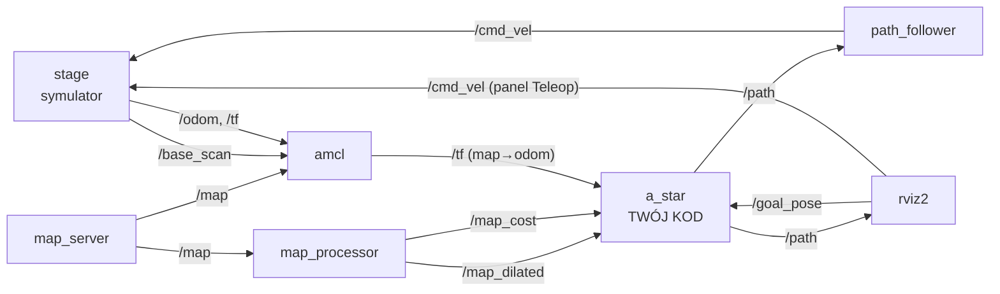

# Wprowadzenie do ROS 2 i symulacji w Stage

Ta instrukcja jest **częścią wprowadzającą** do laboratorium z planowania trasy algorytmem A\*. Za jej wykonanie nie ma osobnych punktów, ale bez niej nie da się sensownie zrobić części punktowanej (`02_a_star.md`). Zakładamy, że nie miałeś wcześniej styczności z ROS 2.

## 1. Cel i przebieg laboratorium

Celem całego laboratorium jest uzupełnienie programu, który w symulacji planuje trasę mobilnego robota po mapie za pomocą algorytmu A\*. Robot ma:

1. otrzymać cel wskazany myszą w RViz2,
2. wyznaczyć trasę z aktualnej pozycji do celu (**to jest Twoje zadanie**),
3. przejechać po niej dzięki gotowemu węzłowi `path_follower`.

Laboratorium składa się z dwóch części:

| Plik | Zawartość | Punkty |
|------|-----------|--------|
| `01_wprowadzenie_ros2.md` (ten plik) | podstawy ROS 2, praca z symulacją z poziomu terminala | brak |
| `02_a_star.md` | teoria A\*, pseudokod, zadania programistyczne | tak |

W ćwiczeniu korzystamy z następujących narzędzi:

| Narzędzie | Rola |
|-----------|------|
| **ROS 2 (Lyrical)** | komunikacja między programami, narzędzia CLI |
| **Stage** (pakiet `stage_ros2`) | prosty symulator 2D robota z lidarem, publikuje odometrię i skan |
| **RViz2** | wizualizacja danych (mapa, skan, trasa) i wskazywanie celu |
| **Nav2: `map_server`, `amcl`** | udostępnienie mapy i lokalizacja robota na mapie |
| **colcon** | budowanie pakietów |
| **C++17, VS Code** | język i edytor |

Ta instrukcja składa się z dwóch etapów. Najpierw (punkty 2 i 3) poznasz pojęcia ROS 2 i architekturę naszego ćwiczenia, a następnie (punkt 4) sprawdzisz je w praktyce na działającej symulacji. W punkcie 4 wykonujesz polecenia, obserwujesz ich efekty i odpowiadasz na pytania. Pod każdym pytaniem znajduje się rozwijane wyjaśnienie — zajrzyj do niego dopiero po własnej próbie odpowiedzi.

## 2. Podstawowe pojęcia ROS 2

ROS 2 (Robot Operating System 2) nie jest systemem operacyjnym. To zestaw bibliotek, narzędzi i konwencji, który pozwala wielu niezależnym programom (np. sterownik silników, lokalizacja, planer trasy) wymieniać dane bez pisania własnej komunikacji. Pełna dokumentacja: <https://docs.ros.org/en/lyrical/ROS-Framework.html>.

### 2.1. Węzły (nodes)

Węzeł to pojedynczy działający program realizujący jedno konkretne zadanie, np. obsługę lidaru albo planowanie trasy. Cały system składa się z wielu takich węzłów, które działają równolegle. Każdy węzeł ma nazwę (np. `/a_star`), po której można go odnaleźć w systemie. W naszym ćwiczeniu węzłami są m.in. symulator, RViz2, `map_server`, `amcl`, `map_processor`, `a_star` i `path_follower`. Twoim zadaniem będzie rozbudowa węzła `a_star`.

### 2.2. Tematy i wiadomości (topics, messages)

Węzły wymieniają dane głównie za pomocą **tematów** w modelu **publikuj–subskrybuj**:

- **temat** (topic) to nazwany kanał, np. `/cmd_vel`, przez który przesyłane są wiadomości jednego, ustalonego typu,
- **publisher** wysyła wiadomości na temat,
- **subscriber** odbiera je i każdą nową wiadomość obsługuje w funkcji zwrotnej (*callback*).

Nadawca i odbiorca nie muszą o sobie nic wiedzieć — łączy ich wyłącznie nazwa tematu, a na jednym temacie może być wielu nadawców i odbiorców. Dzięki temu można na przykład podmienić symulator na prawdziwego robota bez zmian w pozostałych programach.

**Wiadomość** (message) to struktura danych o ustalonych polach. Na przykład `geometry_msgs/msg/Twist` zawiera prędkość liniową `linear` i prędkość kątową `angular`. Definicję dowolnego typu wiadomości można wyświetlić poleceniem `ros2 interface show`.

Poza tematami ROS 2 oferuje jeszcze **serwisy** (zapytanie i odpowiedź) oraz **akcje** (długotrwałe zadania z informacją o postępie), ale w tym ćwiczeniu używamy wyłącznie tematów.

### 2.3. Pakiety i przestrzeń robocza

**Pakiet** (package) to podstawowa jednostka organizacji kodu: zawiera kod, opis zależności (`package.xml`), konfigurację budowania (`CMakeLists.txt`), pliki launch i konfiguracyjne. Pakiety leżą w katalogu `src` **przestrzeni roboczej** (workspace):

```
~/nmsi_ws/
├── src/
│   └── NMSI/
│       ├── nmsi_lab/      <- pakiet z ćwiczeniem
│       ├── stage_ros2/    <- integracja symulatora Stage z ROS 2
│       └── ...
├── build/    <- tworzone przez colcon
├── install/  <- tworzone przez colcon
└── log/      <- tworzone przez colcon
```

Kod edytujesz tylko w `src`. Katalogi `build`, `install` i `log` tworzy narzędzie `colcon` podczas budowania pakietów i nie należy ich modyfikować ręcznie. Przestrzeń robocza jest ładowana automatycznie w każdym nowym terminalu, dlatego po zbudowaniu pakietu ROS od razu znajduje zbudowane programy.

### 2.4. Parametry i pliki launch

Zachowanie węzła można zmieniać bez ingerencji w jego kod za pomocą **parametrów**. Przykładem jest `robot_radius` węzła `map_processor`, który określa, o ile mają zostać „pogrubione" przeszkody na mapie. Parametry przekazuje się przy uruchamianiu węzła, najczęściej z pliku YAML (u nas `config/nav_config.yaml`) albo bezpośrednio w pliku launch.

Uruchamianie każdego węzła osobno byłoby uciążliwe, dlatego używa się **plików launch** (`launch/*.launch.py`), które uruchamiają wiele węzłów naraz i ustawiają ich parametry. W ćwiczeniu są dwa takie pliki:

- `simulation.launch.py` uruchamia symulator, RViz2, serwer mapy i lokalizację; nie modyfikujesz go,
- `robot_controller.launch.py` uruchamia węzły `a_star` i `path_follower`; to dzięki niemu Twój kod trafi do działającego systemu.

### 2.5. TF — układy współrzędnych

Ta sama pozycja ma inne współrzędne zależnie od tego, względem czego ją opisujemy: inne względem mapy, a inne względem samego robota. Dlatego robot i jego otoczenie opisuje się w wielu **układach współrzędnych**, a zależności między nimi publikuje mechanizm **TF** (na temacie `/tf`). W ćwiczeniu pojawiają się trzy układy:

| Układ | Znaczenie |
|-------|-----------|
| `map` | globalny, nieruchomy układ związany z mapą; w nim planujemy trasę |
| `odom` | układ, w którym pozycję robota wyznacza się z odometrii (ruchu kół); z czasem narasta w niej błąd, czyli „dryf" |
| `base_link` | układ przymocowany do robota, porusza się razem z nim |

Układy tworzą łańcuch: `map` jest układem nadrzędnym względem `odom`, a `odom` względem `base_link`. Każde ogniwo tego łańcucha publikuje inny węzeł. Przekształcenie `odom → base_link`, czyli pozycję robota policzoną z odometrii, publikuje symulator. Przekształcenie `map → odom` publikuje węzeł `amcl`, który porównuje odczyty lasera z mapą i na tej podstawie koryguje dryf odometrii. TF potrafi złożyć oba przekształcenia i podać pozycję robota bezpośrednio w układzie `map`. Właśnie tak szkielet `a_star.cpp` wyznacza punkt startowy (`lookupTransform("map", "base_link", ...)`), nie wiedząc nic o odometrii ani lokalizacji.

### 2.6. Czas symulacji

Symulacja nie musi biec dokładnie w tempie rzeczywistego czasu, dlatego węzły w tym ćwiczeniu mają ustawiony parametr `use_sim_time: true`. Oznacza on, że zamiast zegara komputera używają czasu publikowanego przez symulator na temacie `/clock`. W praktyce `now()` w kodzie węzła zwraca czas symulacji, o czym warto pamiętać, gdy w logach zobaczysz nietypowe znaczniki czasu.

### 2.7. Mapa jako `nav_msgs/msg/OccupancyGrid`

Mapa w ROS 2 to siatka komórek o stałym rozmiarze, przesyłana jako wiadomość `nav_msgs/msg/OccupancyGrid`. Każda komórka mówi, czy jest wolna, zajęta, czy nieznana. Dokładną budowę wiadomości i sposób numerowania komórek omawia `02_a_star.md`. Tu wystarczy wiedzieć, że w ćwiczeniu będą dostępne trzy wersje mapy; dwie ostatnie węzeł `map_processor` tworzy na podstawie pierwszej:

| Temat | Kto publikuje | Zawartość |
|-------|---------------|-----------|
| `/map` | `map_server` | oryginalna mapa z pliku (wolne / zajęte / nieznane) |
| `/map_dilated` | `map_processor` | mapa z przeszkodami „pogrubionymi" o promień robota — robota można traktować jak punkt |
| `/map_cost` | `map_processor` | koszt 0–100 rosnący w miarę zbliżania się do przeszkód |

## 3. Architektura ćwiczenia

Zanim zaczniemy eksperymentować, warto zobaczyć, jak wszystkie węzły są ze sobą połączone. Poniższy diagram pokazuje węzły (prostokąty) i tematy (podpisy strzałek). Strzałka prowadzi od węzła, który publikuje dane, do węzła, który je subskrybuje. Węzeł `a_star` jest wyróżniony, bo to jego uzupełnisz w części punktowanej.



Diagram można odczytać jako historię jednego zadania dla robota:

1. Wskazujesz cel narzędziem **2D Goal Pose** w RViz2, a RViz2 publikuje go na temat `/goal_pose`.
2. Węzeł `a_star` odbiera cel, pyta TF o aktualną pozycję robota na mapie i wyznacza trasę, którą publikuje na temat `/path` (docelowo, gdy uzupełnisz jego kod). Do planowania wykorzystuje mapy `/map_dilated` i `/map_cost` przygotowane przez `map_processor`.
3. Węzeł `path_follower` odbiera `/path` i co 100 ms publikuje na `/cmd_vel` prędkość (typ `geometry_msgs/msg/Twist`), która prowadzi robota do kolejnego punktu trasy.
4. Symulator wykonuje ruch robota i publikuje nową odometrię oraz odczyty lasera. Na ich podstawie `amcl` na bieżąco aktualizuje położenie robota na mapie, więc przy następnym celu `a_star` znowu dostanie aktualną pozycję.

Na tym samym temacie `/cmd_vel` może publikować również panel Teleop w RViz2, co pozwala sterować robotem ręcznie.

W szkielecie, który dostajesz, `a_star` zamiast trasy publikuje na razie prosty odcinek od startu do celu. Zobaczysz to w punkcie 4.10.

## 4. Praca z symulacją

W tej części sprawdzisz opisane wcześniej pojęcia na działającej symulacji: uruchomisz ją, obejrzysz jej dane z poziomu terminala i poruszysz robotem.

Polecenia wpisujesz w terminalu Guake, który rozwija się i chowa klawiszem **F12**. Do pracy potrzebujesz kilku terminali jednocześnie, więc każdy nowy otwieraj jako **nową kartę** Guake (**Ctrl+Shift+T**). Procesy działające w danej karcie, np. symulację, można zatrzymać klawiszami **Ctrl+C**.

### 4.1. Uruchomienie symulacji

W pierwszej karcie terminala uruchom symulację:

```bash
ros2 launch nmsi_lab simulation.launch.py world:=hallway
```

Jedno polecenie uruchamia naraz kilka węzłów wymienionych w pliku `simulation.launch.py`. Po kilku sekundach pojawią się dwa okna: **Stage** (symulator z widokiem świata i robotem) oraz **RViz2** (z gotową konfiguracją: mapa, odczyty lasera, układy TF, trasa i panel Teleop). Mapa w RViz2 pojawi się z krótkim opóźnieniem, bo `map_server` i `amcl` są uruchamiane dopiero przez `lifecycle_manager`. Parametr `world:=` wybiera świat: `cave` (domyślny), `hallway` albo `lines`.

Tej karty nie zamykaj, bo działa w niej cała symulacja. Można ją zatrzymać klawiszami Ctrl+C; nie zamykaj okien Stage i RViz2 krzyżykiem.

### 4.2. Węzły

Otwórz nową kartę, wypisz działające węzły, a potem zobacz, z czym komunikuje się jeden z nich:

```bash
ros2 node list
ros2 node info /map_processor
```

Na liście znajdziesz m.in. `/stage`, `/rviz2`, `/map_server` i `/amcl`. Polecenie `node info` wypisuje tematy, które węzeł subskrybuje (*Subscribers*) i publikuje (*Publishers*).

Jaką rolę pełni w systemie węzeł `map_processor`?

<details>
<summary>Wyjaśnienie</summary>

`map_processor` subskrybuje `/map` i na jej podstawie publikuje dwie nowe mapy: `/map_dilated` i `/map_cost`. Sam nie komunikuje się z robotem — jest pośrednikiem, który przygotowuje dane dla planera.

</details>

### 4.3. Tematy

Wypisz wszystkie tematy razem z typami wiadomości i znajdź wśród nich `/map`, `/map_dilated`, `/base_scan`, `/cmd_vel`, `/odom` i `/tf`. Następnie sprawdź, kto korzysta z tematu `/base_scan` i jak często pojawiają się na nim nowe wiadomości:

```bash
ros2 topic list -t
ros2 topic info /base_scan --verbose
ros2 topic hz /base_scan
```

Polecenie `hz` działa bez końca — przerwij je klawiszami Ctrl+C.

Który węzeł publikuje dane z lasera, a które je odbierają? Do czego służą im te dane?

<details>
<summary>Wyjaśnienie</summary>

Odczyty lasera publikuje symulator (`/stage`). Odbiera je `amcl`, który porównuje je z mapą, aby określić położenie robota, oraz RViz2, który rysuje je na ekranie jako punkty. Dane z lasera publikowane są cyklicznie, niezależnie od tego, czy robot się porusza.

</details>

### 4.4. Wiadomości i mapa

Obejrzyj definicje dwóch typów wiadomości: `Twist` (przyda się przy sterowaniu robotem) i `OccupancyGrid` (mapa). Potem wyświetl metadane mapy:

```bash
ros2 interface show geometry_msgs/msg/Twist
ros2 interface show nav_msgs/msg/OccupancyGrid
ros2 topic echo /map --once --field info
```

Tablicę `data` pomijamy, bo ma dziesiątki tysięcy elementów — dlatego wypisujemy tylko pole `info`. Jeśli `echo` nic nie wypisuje, poczekaj chwilę na załadowanie mapy albo dodaj opcje `--qos-durability transient_local --qos-reliability reliable` (mapa jest publikowana tylko raz, więc odbiorca musi o nią w ten sposób poprosić). W definicji `Twist` zobaczysz dwa wektory, `linear` i `angular`, a w `OccupancyGrid` pola `info` i `data`. Zapisz sobie `resolution`, `width`, `height` i `origin` — będą potrzebne w zadaniu.

Ile metrów ma mapa wzdłuż osi x i co oznacza `origin`?

<details>
<summary>Wyjaśnienie</summary>

Szerokość mapy w metrach to `width` razy `resolution` (rozmiar jednej komórki w metrach) i powinna odpowiadać rozmiarowi świata (dla `hallway` 25 m). Pole `origin` określa położenie w układzie `map` lewego dolnego rogu mapy, czyli punktu, od którego liczone są komórki.

</details>

### 4.5. Graf węzłów i tematów

W nowej karcie uruchom narzędzie rysujące połączenia między węzłami:

```bash
rqt_graph
```

Węzły są na nim połączone strzałkami opisanymi nazwami tematów. Jeśli widzisz tylko węzły, wybierz w górnym menu widok *Nodes/Topics (all)* i odśwież wykres przyciskiem w lewym górnym rogu. Porównaj go z diagramem z punktu 3: których węzłów jeszcze brakuje i dlaczego?

<details>
<summary>Wyjaśnienie</summary>

Brakuje `a_star` i `path_follower`, ponieważ uruchamia je dopiero drugi plik launch (`robot_controller.launch.py`). Do tego czasu temat `/path` może mieć odbiorcę (RViz2), który czeka na dane, ale nie ma jeszcze nadawcy.

</details>

### 4.6. Ręczne sterowanie robotem

Robot stoi w miejscu, bo nikt nie wysłał mu polecenia jazdy. W RViz2 zaznacz w panelu Teleop pole *Enabled* i poruszaj robotem za pomocą pola sterowania. Jednocześnie w nowej karcie wypisuj jego pozycję z odometrii:

```bash
ros2 topic echo /odom --field pose.pose.position
```

Współrzędne zmieniają się wraz z ruchem robota. Przerwij `echo` klawiszami Ctrl+C, odznacz *Enabled* i sprawdź, które węzły publikują i subskrybują temat sterowania:

```bash
ros2 topic info /cmd_vel --verbose
```

Skąd symulator wiedział, że ma jechać, i skąd wzięły się współrzędne w terminalu?

<details>
<summary>Wyjaśnienie</summary>

Panel Teleop publikuje na `/cmd_vel` wiadomości typu `Twist`, a symulator je subskrybuje i nadaje robotowi taką prędkość. Symulator publikuje też odometrię na `/odom`, czyli pozycję robota policzoną z jego ruchu — to ją wypisywało polecenie `echo`.

</details>

To samo polecenie można wysłać ręcznie z terminala. Przy wyłączonym panelu Teleop wpisz:

```bash
ros2 topic pub --rate 10 /cmd_vel geometry_msgs/msg/Twist "{linear: {x: 0.3}, angular: {z: 0.0}}"
```

Robot pojedzie prosto. Po kilku sekundach przerwij polecenie klawiszami Ctrl+C, uruchom je ponownie z `angular: {z: 0.5}` (robot pojedzie po łuku) i znowu przerwij. Obserwuj przy tym robota oraz terminal z symulacją, w którym po kilku sekundach pojawi się komunikat `watchdog timeout`.

Dlaczego robot nie zatrzymał się od razu po przerwaniu polecenia? Co z tego wynika dla programu, który ma zatrzymać robota?

<details>
<summary>Wyjaśnienie</summary>

Symulator pamięta ostatnie otrzymane polecenie i wykonuje je, aż dostanie nowe. Dopiero po 5 sekundach bez żadnych poleceń (parametr `base_watchdog_timeout`) zatrzymuje robota. Dlatego program sterujący, taki jak `path_follower`, na końcu trasy publikuje jawnie zerową prędkość.

</details>

> **Uwaga.** Na `/cmd_vel` powinno publikować tylko jedno źródło naraz. Przed uruchomieniem `path_follower` wyłącz panel Teleop i przerwij wszystkie polecenia `ros2 topic pub`, w przeciwnym razie robot dostanie sprzeczne polecenia.

### 4.7. Układy współrzędnych (TF)

Uruchom narzędzie wypisujące pozycję robota w układzie mapy i w tym czasie pojeździj robotem za pomocą panelu Teleop:

```bash
ros2 run tf2_ros tf2_echo map base_link
```

Co sekundę zobaczysz położenie (*Translation*) i orientację (*Rotation*) układu `base_link` względem `map`. Przerwij polecenie klawiszami Ctrl+C, wyłącz Teleop, sprawdź, kto publikuje przekształcenia, i wygeneruj rysunek drzewa układów:

```bash
ros2 topic info /tf --verbose
ros2 run tf2_tools view_frames
```

Drugie polecenie zapisuje w bieżącym katalogu plik `frames_*.pdf` — otwórz go.

Które węzły publikują na `/tf` i jakie ogniwo drzewa układów dostarcza każdy z nich? Dlaczego można zapytać o pozycję `base_link` w układzie `map`, mimo że żaden węzeł nie publikuje takiego przekształcenia bezpośrednio?

<details>
<summary>Wyjaśnienie</summary>

Symulator (`/stage`) publikuje `odom → base_link` oraz położenie czujników na robocie, a `amcl` publikuje `map → odom`. TF składa przekształcenia w łańcuch `map → odom → base_link`, więc pozycję robota w układzie mapy można odczytać tak, jakby została opublikowana bezpośrednio. W ten sam sposób robi to `a_star`.

</details>

### 4.8. Parametry

Zachowanie węzła można zmieniać parametrami. Wypisz parametry węzła `map_processor` i odczytaj jeden z nich:

```bash
ros2 param list /map_processor
ros2 param get /map_processor robot_radius
```

Parametr `robot_radius` to promień robota w metrach, ustawiony w pliku `simulation.launch.py`. O tę odległość `map_processor` „pogrubia" przeszkody na mapie. Efekt zobaczysz w następnym kroku.

### 4.9. Mapy w RViz2

W panelu *Displays* po lewej stronie RViz2 rozwiń wyświetlacz **Map**. W polu **Topic** zmieniaj kolejno temat na `/map`, `/map_dilated` i `/map_cost` i porównuj, jak wyglądają ściany i przeszkody. Polem wyboru przy nazwie wyświetlacza możesz go wyłączyć, żeby zobaczyć sam świat. Jeśli po zmianie tematu mapa się nie wyświetla, rozwiń pole *Topic* i sprawdź, czy *Durability Policy* ma wartość *Transient Local*.

Czym różnią się te trzy mapy i dlaczego planer ma korzystać z `/map_dilated`, a nie z oryginalnej `/map`?

<details>
<summary>Wyjaśnienie</summary>

Na `/map_dilated` przeszkody są powiększone o promień robota. Jeśli środek robota znajduje się w wolnej komórce tej mapy, robot nie dotyka ściany, więc planując trasę można go traktować jak punkt. Mapa `/map_cost` zawiera koszt od 0 (daleko od przeszkody) do 100 (przy przeszkodzie); pozwala planerowi preferować trasy biegnące z dala od ścian.

</details>

### 4.10. Budowanie i uruchomienie szkieletu programu

Zbuduj pakiet z ćwiczeniem:

```bash
cd ~/nmsi_ws
colcon build --symlink-install --packages-select nmsi_lab
```

Jeśli budowanie się powiodło, na końcu zobaczysz podsumowanie `Summary: 1 package finished`. W razie błędu szukaj pierwszej linii zawierającej `error:`. Po **każdej** zmianie kodu C++ trzeba ponownie zbudować pakiet i zrestartować węzły (Ctrl+C w karcie z `robot_controller.launch.py` i ponowne uruchomienie).

Przy działającej symulacji i wyłączonym panelu Teleop uruchom w nowej karcie węzły ze szkieletu:

```bash
ros2 launch nmsi_lab robot_controller.launch.py
```

W RViz2 wybierz narzędzie **2D Goal Pose** na górnym pasku, kliknij punkt na mapie po drugiej stronie przeszkody i przeciągnij kursor (kierunek nie ma tu znaczenia). Potem w innej karcie wypisz otrzymaną trasę:

```bash
ros2 topic echo /path --once
```

W RViz2 pojawi się zielona trasa `/path`, a `path_follower` wypisze w terminalu `Path registered`, a po dojechaniu `Goal achieved...`. Robot jedzie prosto do celu, a jeśli po drodze jest ściana, zatrzymuje się na niej (jeśli utknie, zatrzymaj go klawiszami Ctrl+C w karcie z `robot_controller.launch.py`). Lista `poses` zawiera tylko dwa punkty.

Dlaczego robot nie omija przeszkód i co musi zrobić `a_star`, żeby dojechał do celu bezpiecznie?

<details>
<summary>Wyjaśnienie</summary>

Szkielet nie planuje żadnej trasy: publikuje tylko punkt startowy i cel. `path_follower` nie zna mapy i po prostu jedzie do kolejnych punktów trasy, więc omijanie ścian musi być zapewnione przez samą trasę. Zadaniem `a_star` jest więc zastąpienie tej prostej linii serią punktów, które prowadzą przez wolne komórki mapy.

</details>

To właśnie będzie Twoje zadanie w części punktowanej: wyznaczyć trasę algorytmem A\*.

## 5. Pytania kontrolne

Przed przejściem do `02_a_star.md` sprawdź, czy potrafisz odpowiedzieć na poniższe pytania. Jeśli nie, wróć do odpowiedniego ćwiczenia z punktu 4.

1. Czym różni się węzeł od tematu? Kto publikuje, a kto subskrybuje `/goal_pose`?
2. Jaki typ wiadomości jest używany na `/cmd_vel` i które jego pola sterują robotem?
3. W którym układzie współrzędnych `a_star` planuje trasę i skąd zna pozycję robota w tym układzie?
4. Co robi `map_processor` i czym różni się `/map_dilated` od `/map_cost`?
5. Jak sprawdzić w terminalu rozdzielczość i rozmiar mapy?
6. Dlaczego robot ze szkieletu programu jedzie przez ściany?

## 6. Najczęstsze problemy

| Problem | Rozwiązanie |
|---------|-------------|
| `ros2: command not found` | Otwórz nową kartę terminala. Jeśli problem nie znika, zgłoś to prowadzącemu. |
| `Package 'nmsi_lab' not found` | Zbuduj pakiet (punkt 4.10) i otwórz nową kartę terminala. |
| Zmiana w kodzie nie działa | Zbuduj pakiet ponownie i uruchom węzły od nowa. |
| W RViz2 nie ma mapy | Poczekaj kilka sekund, bo mapa pojawia się z opóźnieniem. Sprawdź, czy w wyświetlaczu Map wybrany jest właściwy temat i czy *Durability Policy* ma wartość *Transient Local*. |
| `Could not transform base_link to map` | Zwykle `amcl` jeszcze się nie uruchomił. Poczekaj chwilę lub sprawdź `ros2 run tf2_ros tf2_echo map base_link`. |
| Robot jedzie chaotycznie | Na `/cmd_vel` publikuje więcej niż jedno źródło (Teleop, `ros2 topic pub`, `path_follower`). Zostaw tylko jedno. |
| Po zamknięciu okna Stage lub RViz2 coś nadal działa | Procesy kończ klawiszami Ctrl+C w karcie, w której zostały uruchomione. Zamknięcie samego okna nie zatrzymuje pozostałych węzłów. |

## 7. Ściąga poleceń

| Polecenie | Opis |
|-----------|------|
| `ros2 launch nmsi_lab simulation.launch.py world:=hallway` | symulacja (`cave`, `hallway`, `lines`) |
| `ros2 launch nmsi_lab robot_controller.launch.py` | węzły `a_star` i `path_follower` |
| `ros2 node list` / `ros2 node info <węzeł>` | węzły |
| `ros2 topic list -t` | tematy z typami |
| `ros2 topic info <temat> --verbose` | typ oraz węzły publikujące i subskrybujące |
| `ros2 topic echo <temat> --once` | jedna wiadomość |
| `ros2 topic hz <temat>` | częstotliwość |
| `ros2 topic pub --rate 10 <temat> <typ> "<dane YAML>"` | publikowanie z terminala |
| `ros2 interface show <typ>` | definicja wiadomości |
| `ros2 param list/get <węzeł> [parametr]` | parametry |
| `ros2 run tf2_ros tf2_echo <z> <do>` | przekształcenie TF |
| `ros2 run tf2_tools view_frames` | drzewo układów w pliku PDF |
| `rqt_graph` | graf węzłów i tematów |
| `colcon build --symlink-install --packages-select nmsi_lab` | budowanie pakietu |
