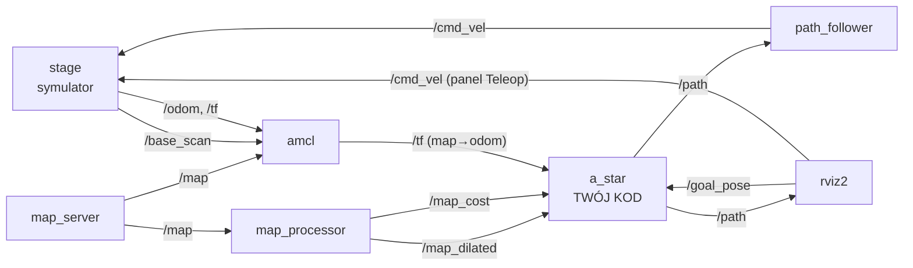

# Wprowadzenie do ROS 2 i symulacji w Stage

Ta instrukcja jest **częścią wprowadzającą** do laboratorium z planowania trasy algorytmem A\*. Za jej wykonanie nie ma osobnych punktów, ale bez niej nie da się sensownie zrobić części punktowanej (`02_a_star.md`). Zakładamy, że nie miałeś wcześniej styczności z ROS 2.

## 1. Cel i przebieg laboratorium

Celem całego laboratorium jest uzupełnienie programu, który w symulacji planuje trasę mobilnego robota po mapie za pomocą algorytmu A\*. Robot ma:

1. otrzymać cel wskazany myszą w RViz2,
2. wyznaczyć trasę z aktualnej pozycji do celu (**to jest Twoje zadanie**),
3. przejechać po niej dzięki gotowemu węzłowi `path_follower`.

Laboratorium składa się z dwóch części:

| Plik | Zawartość | Punkty |
|------|-----------|--------|
| `01_wprowadzenie_ros2.md` (ten plik) | podstawy ROS 2, praca z symulacją z poziomu terminala | brak |
| `02_a_star.md` | teoria A\*, pseudokod, zadania programistyczne | tak |

Wykorzystywane narzędzia:

| Narzędzie | Rola |
|-----------|------|
| **ROS 2 (Lyrical)** | komunikacja między programami, narzędzia CLI |
| **Stage** (pakiet `stage_ros2`) | prosty symulator 2D robota z lidarem, publikuje odometrię i skan |
| **RViz2** | wizualizacja danych (mapa, skan, trasa) i wskazywanie celu |
| **Nav2: `map_server`, `amcl`** | udostępnienie mapy i lokalizacja robota na mapie |
| **colcon** | budowanie pakietów |
| **C++17, VS Code** | język i edytor |

Instalacja środowiska została przygotowana przez prowadzącego — niczego nie instaluj samodzielnie.

## 2. Podstawowe pojęcia ROS 2

ROS 2 (Robot Operating System 2) nie jest systemem operacyjnym. To zestaw bibliotek, narzędzi i konwencji, który pozwala wielu niezależnym programom (np. sterownik silników, lokalizacja, planer trasy) wymieniać dane bez pisania własnej komunikacji. Pełna dokumentacja: <https://docs.ros.org/en/lyrical/ROS-Framework.html>.

### 2.1. Węzły (nodes)

Węzeł to pojedynczy działający program realizujący jedno konkretne zadanie. Każdy węzeł ma nazwę (np. `/a_star`). W naszym ćwiczeniu węzły to m.in. symulator, RViz2, `map_server`, `amcl`, `map_processor`, `a_star` i `path_follower`.

### 2.2. Tematy i wiadomości (topics, messages)

Podstawowy sposób komunikacji to model **publikuj–subskrybuj**:

- **temat** (topic) to nazwany kanał, np. `/cmd_vel`, z ustalonym typem wiadomości,
- **publisher** wysyła wiadomości na temat,
- **subscriber** je odbiera (każdą nową wiadomość obsługuje funkcja zwrotna — *callback*),
- nadawca i odbiorca o sobie nie wiedzą; mogą ich być dowolnie wielu.

**Wiadomość** (message) to struktura danych o ustalonych polach, np. `geometry_msgs/msg/Twist` zawiera prędkość liniową `linear` i kątową `angular`. Definicje typów można podejrzeć poleceniem `ros2 interface show`.

Poza tematami ROS 2 oferuje jeszcze **serwisy** (zapytanie–odpowiedź) i **akcje** (długotrwałe zadania z informacją zwrotną). W tym ćwiczeniu używamy wyłącznie tematów.

### 2.3. QoS — jakość usługi komunikacji

Każdy publisher i subscriber ma ustawiony profil QoS (*Quality of Service*). Dla nas istotne jest **durability**:

- `volatile` — odbiorca dostaje tylko wiadomości wysłane po jego podłączeniu (typowe dla danych strumieniowych, np. skan lasera),
- `transient_local` — publisher zapamiętuje ostatnią wiadomość i wysyła ją każdemu nowemu odbiorcy (tak zachowują się **mapy**, publikowane tylko raz).

Jeśli publisher i subscriber mają niezgodne QoS, wiadomości **nie dotrą**, a ROS nie zawsze zgłosi błąd. W szkielecie programu mapy są odbierane z `QoS(1).transient_local().reliable()` właśnie dlatego, że mapa jest publikowana jednorazowo.

### 2.4. Pakiety i przestrzeń robocza

**Pakiet** (package) to podstawowa jednostka organizacji kodu: zawiera kod, opis zależności (`package.xml`), konfigurację budowania (`CMakeLists.txt`), pliki launch i konfiguracyjne. Pakiety leżą w katalogu `src` **przestrzeni roboczej** (workspace):

```
~/nmsi_ws/
├── src/
│   └── NMSI/
│       ├── nmsi_lab/      <- pakiet z ćwiczeniem
│       ├── stage_ros2/    <- integracja symulatora Stage z ROS 2
│       └── ...
├── build/    <- tworzone przez colcon
├── install/  <- tworzone przez colcon
└── log/      <- tworzone przez colcon
```

Kod edytujesz tylko w `src`. Po zbudowaniu pakietu (`colcon build`) w każdym terminalu trzeba wykonać `source install/setup.bash`, aby ROS znalazł zbudowane programy.

### 2.5. Parametry i pliki launch

- **Parametr** to ustawienie węzła (np. `robot_radius` węzła `map_processor`) przekazywane przy uruchomieniu lub w pliku YAML (`config/nav_config.yaml`).
- **Plik launch** (`launch/*.launch.py`) uruchamia kilka węzłów naraz z zadanymi parametrami. W ćwiczeniu są dwa:
  - `simulation.launch.py` — symulator, RViz2, mapa, lokalizacja (nie modyfikujesz),
  - `robot_controller.launch.py` — węzły `a_star` i `path_follower`.

### 2.6. TF — układy współrzędnych

Robot i jego otoczenie opisuje się w wielu układach współrzędnych. Zależności między nimi zapisuje mechanizm **TF** (temat `/tf`). U nas:

| Układ | Znaczenie |
|-------|-----------|
| `map` | globalny, nieruchomy układ mapy — w nim planujemy trasę |
| `odom` | układ odometrii; położenie wyliczone z ruchu kół, z czasem „dryfuje" |
| `base_link` | układ związany z robotem |

Łańcuch przekształceń: `map → odom → base_link`. Przekształcenie `odom → base_link` publikuje symulator, a `map → odom` publikuje `amcl` (lokalizacja robota na mapie metodą filtru cząsteczkowego). Dzięki temu można zapytać TF o pozycję robota **w układzie mapy** — właśnie tak szkielet `a_star.cpp` wyznacza punkt startowy (`lookupTransform("map", "base_link", ...)`).

### 2.7. Czas symulacji

Węzły w tym ćwiczeniu mają ustawione `use_sim_time: true`, czyli korzystają z czasu publikowanego przez symulator na temacie `/clock`, a nie z zegara komputera. Dlatego `now()` w węźle zwraca czas symulacji.

### 2.8. Mapa jako `nav_msgs/msg/OccupancyGrid`

Mapa jest siatką komórek o stałym rozmiarze. Szczegóły (pola, indeksowanie) omówiono w `02_a_star.md`. Tu wystarczy wiedzieć, że w ćwiczeniu pojawiają się trzy mapy:

| Temat | Kto publikuje | Zawartość |
|-------|---------------|-----------|
| `/map` | `map_server` | oryginalna mapa z pliku (wolne / zajęte / nieznane) |
| `/map_dilated` | `map_processor` | mapa z przeszkodami „pogrubionymi" o promień robota — robota można traktować jak punkt |
| `/map_cost` | `map_processor` | koszt 0–100 rosnący w miarę zbliżania się do przeszkód |

## 3. Architektura ćwiczenia



Przepływ działania:

1. Wskazujesz cel narzędziem **2D Goal Pose** w RViz2 → wiadomość na `/goal_pose`.
2. Węzeł `a_star` odbiera cel, pobiera z TF aktualną pozycję robota i (po uzupełnieniu przez Ciebie) wyznacza trasę, którą publikuje na `/path`.
3. Węzeł `path_follower` odbiera `/path` i co 100 ms publikuje na `/cmd_vel` prędkość (typ `geometry_msgs/msg/Twist`), która prowadzi robota do kolejnych punktów trasy.
4. Symulator wykonuje ruch i publikuje nową odometrię oraz skan.

W szkielecie `a_star` publikuje na razie tylko odcinek prosty od startu do celu — zobaczysz to w punkcie 4.10.

## 4. Praca z symulacją z poziomu terminala

W kolejnych krokach potrzebujesz kilku terminali. Każdy **nowy** terminal wymaga załadowania przestrzeni roboczej:

```bash
source ~/nmsi_ws/install/setup.bash
```

Jeżeli po `source` dostajesz `Package 'nmsi_lab' not found`, najpierw zbuduj pakiety (punkt 4.10).

### 4.1. Uruchomienie symulacji (terminal 1)

```bash
ros2 launch nmsi_lab simulation.launch.py world:=hallway
```

Dostępne światy: `cave` (domyślny), `hallway`, `lines`. Po kilku sekundach pojawią się okna **Stage** (symulator) i **RViz2** (z gotową konfiguracją: mapa, skan lasera, układy TF, trasa, panel Teleop). Terminal 1 zostaw w spokoju — działa w nim cała symulacja. Zatrzymanie: `Ctrl+C`.

Mapa pojawi się w RViz2 z krótkim opóźnieniem, bo `map_server` i `amcl` są uruchamiane przez `lifecycle_manager`.

### 4.2. Węzły (terminal 2)

```bash
ros2 node list
ros2 node info /map_processor
```

`node info` pokazuje, jakie tematy węzeł publikuje i subskrybuje. Znajdź w wyniku tematy `/map_dilated` i `/map_cost`.

### 4.3. Tematy

```bash
ros2 topic list
ros2 topic list -t                      # z typami wiadomości
ros2 topic info /map --verbose          # typ, publisherzy, subscriberzy, QoS
ros2 topic hz /base_scan                # z jaką częstotliwością przychodzi skan
ros2 topic echo /odom --once            # jedna wiadomość odometrii
```

Zwróć uwagę na wynik `info /map --verbose`: `Durability: TRANSIENT_LOCAL`.

### 4.4. Budowa wiadomości

```bash
ros2 interface show geometry_msgs/msg/Twist
ros2 interface show sensor_msgs/msg/LaserScan
ros2 interface show nav_msgs/msg/OccupancyGrid
ros2 interface show nav_msgs/msg/Path
```

Mapa jest duża, więc nie wypisuj jej w całości. Metadane i bez tablicy danych:

```bash
ros2 topic echo /map_dilated --once --field info
ros2 topic echo /map_dilated --once --no-arr
```

Zapisz sobie `resolution`, `width`, `height` oraz `origin.position` — będą potrzebne w zadaniu. Jeżeli `echo` nic nie wyświetla dla tematu z `transient_local`, dodaj `--qos-durability transient_local --qos-reliability reliable`.

### 4.5. Graf węzłów i tematów

```bash
rqt_graph
```

Porównaj widok z diagramem z punktu 3. Odśwież widok przyciskiem w lewym górnym rogu, jeżeli jest pusty.

### 4.6. TF

```bash
ros2 run tf2_ros tf2_echo map base_link       # pozycja robota w układzie mapy
ros2 run tf2_tools view_frames                # tworzy frames_*.pdf z drzewem układów
```

Przerwij `tf2_echo` przez `Ctrl+C`. Sprawdź, kto publikuje przekształcenia `map→odom` i `odom→base_link`.

### 4.7. Parametry

```bash
ros2 param list /map_processor
ros2 param get /map_processor robot_radius
ros2 param get /amcl base_frame_id
```

### 4.8. Ręczne sterowanie robotem

Robot nie rusza, dopóki ktoś nie opublikuje prędkości na `/cmd_vel`. Dwa sposoby:

**a) Panel Teleop w RViz2** — zaznacz pole *Enabled* i użyj pola sterowania. Odznacz *Enabled*, żeby przestać publikować.

**b) Z terminala:**

```bash
ros2 topic pub --rate 10 /cmd_vel geometry_msgs/msg/Twist "{linear: {x: 0.3}, angular: {z: 0.0}}"
```

Zmień `angular.z` na `0.5` i zobacz, co się stanie. Zatrzymaj publikowanie przez `Ctrl+C`. W trakcie jazdy w drugim terminalu uruchom ponownie `tf2_echo map base_link` i obserwuj zmianę pozycji.

> **Uwaga.** Zawsze tylko jedno źródło powinno publikować na `/cmd_vel`. Przed uruchomieniem `path_follower` wyłącz panel Teleop i przerwij wszystkie `ros2 topic pub`, inaczej robot dostanie sprzeczne polecenia.

### 4.9. Podgląd map w RViz2

W RViz2: *Add → By topic → /map_dilated → Map* oraz tak samo dla `/map_cost`. Jeżeli mapa się nie wyświetla, rozwiń wyświetlacz *Topic* i ustaw **Durability Policy: Transient Local**. Włączaj i wyłączaj wyświetlacze (checkbox), porównaj `/map`, `/map_dilated` i `/map_cost`. Co zmieniło się w pobliżu ścian?

### 4.10. Budowanie i uruchomienie szkieletu programu

Zbuduj pakiet:

```bash
cd ~/nmsi_ws
colcon build --symlink-install --packages-select nmsi_lab
source install/setup.bash
```

Po **każdej** zmianie kodu C++ trzeba ponownie wykonać `colcon build`, a następnie zrestartować węzeł. Przy błędach kompilacji szukaj pierwszej linii zawierającej `error:`.

Przy działającej symulacji uruchom w nowym terminalu:

```bash
ros2 launch nmsi_lab robot_controller.launch.py
```

W RViz2 wybierz **2D Goal Pose**, kliknij punkt na mapie i przeciągnij kursor (kierunek nie ma tu znaczenia). Obserwuj:

- zielony odcinek `/path` w RViz2 — to „trasa" ze szkieletu, prosta linia ignorująca ściany,
- komunikaty `path_follower` w terminalu (`Path registered`, `Goal achieved...`),
- robot jedzie prosto do celu, także przez przeszkody (w Stage zobaczysz zderzenie ze ścianą).

Sprawdź też:

```bash
ros2 topic echo /path --once
ros2 topic echo /goal_pose --once
```

Twoim zadaniem w części punktowanej będzie zastąpienie tej prostej linii trasą wyznaczoną algorytmem A\*.

## 5. Pytania kontrolne

Przed przejściem do `02_a_star.md` upewnij się, że potrafisz odpowiedzieć na pytania:

1. Czym różni się węzeł od tematu? Kto publikuje, a kto subskrybuje `/goal_pose`?
2. Jaki typ wiadomości jest używany na `/cmd_vel` i które jego pola steruje robotem?
3. Dlaczego mapy są publikowane z QoS `transient_local`?
4. W jakich układach współrzędnych jest wyrażona mapa, a w jakim robot? Który węzeł łączy te układy?
5. Co robi `map_processor` i czym różni się `/map_dilated` od `/map_cost`?
6. Jak sprawdzić w terminalu rozdzielczość i rozmiar mapy?

## 6. Najczęstsze problemy

| Problem | Rozwiązanie |
|---------|-------------|
| `ros2: command not found` | Otwórz nowy terminal; sprawdź, czy ROS 2 jest załadowany (`source /opt/ros/lyrical/setup.bash`). |
| `Package 'nmsi_lab' not found` | `cd ~/nmsi_ws && colcon build --symlink-install --packages-select nmsi_lab`, potem `source install/setup.bash`. |
| Zmiana w kodzie nie działa | Zbuduj ponownie i uruchom węzeł od nowa. |
| W RViz2 nie ma mapy | Poczekaj kilka sekund; sprawdź `ros2 topic list`; dla map ustaw w RViz2 *Durability Policy: Transient Local*. |
| `Could not transform base_link to map` | Zwykle `amcl` jeszcze się nie uruchomił; poczekaj chwilę lub sprawdź `ros2 run tf2_ros tf2_echo map base_link`. |
| Robot jeździ chaotycznie | Dwa źródła publikują na `/cmd_vel` (Teleop, `ros2 topic pub`, `path_follower`). Zostaw jedno. |
| Po zamknięciu okna symulacji coś nadal działa | Zawsze kończ procesy przez `Ctrl+C` w terminalu, z którego je uruchomiono. |

## 7. Ściąga poleceń

| Polecenie | Opis |
|-----------|------|
| `ros2 launch nmsi_lab simulation.launch.py world:=hallway` | symulacja (`cave`, `hallway`, `lines`) |
| `ros2 launch nmsi_lab robot_controller.launch.py` | węzły `a_star` i `path_follower` |
| `ros2 node list` / `ros2 node info <węzeł>` | węzły |
| `ros2 topic list -t` | tematy z typami |
| `ros2 topic info <temat> --verbose` | typ i QoS |
| `ros2 topic echo <temat> --once` | jedna wiadomość |
| `ros2 topic hz <temat>` | częstotliwość |
| `ros2 topic pub --rate 10 <temat> <typ> "<dane YAML>"` | publikowanie z terminala |
| `ros2 interface show <typ>` | definicja wiadomości |
| `ros2 param list/get <węzeł> [parametr]` | parametry |
| `ros2 run tf2_ros tf2_echo <z> <do>` | przekształcenie TF |
| `rqt_graph` | graf węzłów i tematów |
| `colcon build --symlink-install --packages-select nmsi_lab` | budowanie pakietu |
| `source ~/nmsi_ws/install/setup.bash` | załadowanie zbudowanych pakietów |
